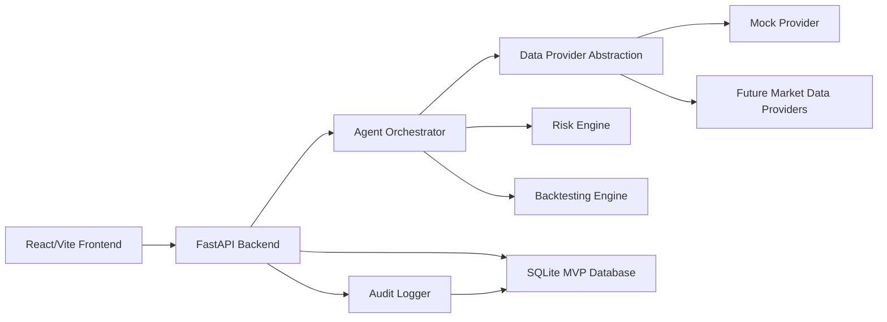
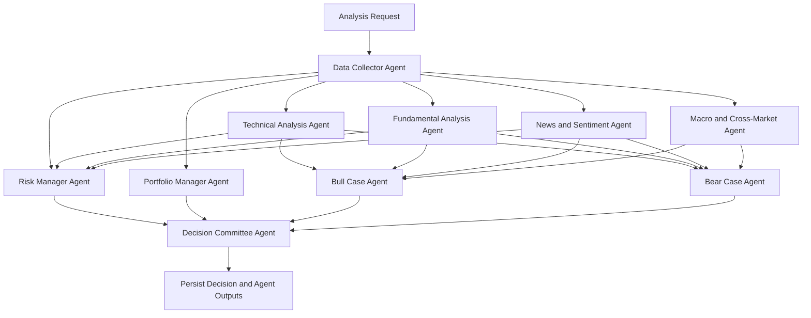

# Wisoka Compass Product Architecture

Status: MVP architecture proposal
Project: Wisoka Compass
Repository: alpha-council
Primary local path: `~/Projects/AlphaCouncil` (retained for local compatibility)
MVP boundary: research, decision support, backtesting, and audit logging only. No live trading.

## 1. Product Vision

Wisoka Compass is a professional multi-agent global equity research and decision-support web application. It behaves like a small investment committee: multiple specialized agents inspect market data, technicals, fundamentals, news, macro conditions, portfolio fit, and risk before producing an explainable decision.

The MVP should help a user make disciplined, auditable research decisions for US, Japanese, Taiwan, and Korean equities. It must not execute real trades. It must produce structured decisions only:

| Decision | Meaning |
| --- | --- |
| BUY | Research supports a long idea, risk controls pass, and a stop loss is present. |
| SELL | Research supports exiting or reducing an existing position. |
| HOLD | Maintain current view or position; no new action. |
| WATCH | Interesting but insufficient confirmation or risk is elevated. |
| AVOID | Risk, data quality, or evidence is unfavorable. |

Every decision must be timestamped, explainable, risk-reviewed, uncertainty-aware, and saved with the full JSON payload.

## 2. MVP Scope

The MVP should implement a serious but buildable decision-support loop:

| Area | MVP Scope |
| --- | --- |
| Markets | US, Japan, Taiwan, Korea equities. |
| Market hours | Hardcoded regular sessions by exchange timezone. |
| Data | Mock/yfinance-style provider interface with deterministic fallback data. |
| Agents | Data collector, technical, fundamental, news/sentiment, macro, bull case, bear case, risk manager, portfolio manager, decision committee. |
| Decisions | BUY, SELL, HOLD, WATCH, AVOID with risk veto and audit log. |
| Watchlist | CRUD for ticker, market, notes, latest signal, risk level. |
| Backtesting | Moving average crossover, RSI oversold rebound, breakout above N-day high. |
| Storage | SQLite with migration-friendly schema. |
| Frontend | Dashboard, stock analysis, watchlist, backtest, decision log. |
| Tests | Backend pytest coverage for core behavior. |
| Trading | Explicitly disabled. No live broker execution. |

## 3. Non-MVP Future Scope

| Future Area | Direction |
| --- | --- |
| Paper trading | Add simulated order and portfolio ledger after decision logging is stable. |
| Broker integration | Add disabled broker adapter interfaces only after paper trading. |
| Real-time data | Add streaming quote adapters and async ingestion workers. |
| Exchange calendars | Replace hardcoded sessions with exchange calendar libraries and holiday feeds. |
| Authentication | Add user accounts, roles, and private workspaces. |
| Portfolio accounting | Add positions, cost basis, PnL, realized/unrealized returns. |
| Advanced risk | Scenario analysis, factor exposure, VaR/CVaR, stress tests. |
| LLM agents | Optional provider-backed reasoning layer with prompt/version audit trail. |
| Notifications | Market alerts, decision review reminders, risk threshold alerts. |
| Deployment | Docker, managed PostgreSQL, scheduled workers, observability stack. |

Broker and paper-trading modules should remain isolated behind interfaces such as `ExecutionProvider` and disabled by config. The MVP should include only stubs with comments stating that live trading is not implemented.

## 4. User Personas

| Persona | Needs | Product Implication |
| --- | --- | --- |
| Individual active investor | Fast, disciplined equity research without emotional overtrading. | Clear signals, risk warnings, watchlist, decision history. |
| Quant-curious researcher | Wants repeatable signals and backtests. | Strategy modules, no future leakage, saved backtest runs. |
| Investment committee-style decision maker | Wants opposing arguments and auditability. | Bull/bear agents, vote table, final explanation. |
| Engineering builder | Wants extensible data/provider architecture. | Provider interfaces, typed schemas, modular agents. |

## 5. Core User Workflows

### 5.1 Daily Dashboard Review

1. User opens dashboard.
2. App shows market status for US, Japan, Taiwan, and Korea.
3. App shows risk summary, watchlist status, latest decisions, bullish signals, bearish signals, and alerts.
4. User selects a ticker needing review.

### 5.2 Stock Analysis Decision

1. User enters ticker, market, time horizon, and strategy preference.
2. Data Collector prepares price, profile, news, market status, and quality metadata.
3. Specialist agents produce structured opinions.
4. Bull and Bear agents synthesize the strongest opposing cases.
5. Risk Manager evaluates veto conditions.
6. Portfolio Manager checks fit and position sizing.
7. Decision Committee resolves conflicts, applies veto, produces final decision, and saves it.
8. User inspects reasoning and risk controls.

### 5.3 Watchlist Review

1. User adds ticker and market.
2. Watchlist stores notes, latest signal, latest risk level, and timestamp.
3. User runs analysis directly from a watchlist row.
4. Latest decision can update watchlist summary fields.

### 5.4 Backtest

1. User selects ticker, market, date range, strategy, and initial capital.
2. Backend retrieves historical prices through the data provider interface.
3. Backtester simulates only with data known at each step.
4. Results include returns, drawdown, win rate, trade log, and equity curve.
5. Result is saved and clearly marked as historical simulation.

### 5.5 Decision Log Review

1. User filters decisions by ticker, market, decision, confidence, and date.
2. User opens a decision detail.
3. App displays final decision, agent votes, risk warnings, data sources, explanation, and full payload.

## 6. System Architecture

### 6.1 High-Level Components



### 6.2 Backend Layers

| Layer | Responsibility |
| --- | --- |
| API routers | HTTP validation, auth placeholder, response shaping. |
| Services | Business workflows such as analysis orchestration and watchlist management. |
| Agents | Deterministic structured research modules. |
| Data providers | Provider-neutral market, company, news, and macro data interfaces. |
| Risk engine | Risk rules, veto, confidence adjustment, position sizing. |
| Backtesting engine | Historical strategy simulation with leakage controls. |
| Repositories | SQLite persistence and query methods. |
| Schemas | Pydantic request/response/domain contracts. |
| Audit | Append structured events and decision payloads. |

### 6.3 Frontend Layers

| Layer | Responsibility |
| --- | --- |
| Pages | Dashboard, Analysis, Watchlist, Backtest, Decision Log. |
| Feature components | Agent cards, risk panel, market status badges, backtest charts. |
| API client | Typed calls to FastAPI endpoints. |
| State | Lightweight page state with future path to TanStack Query. |
| Charts | Recharts for price, equity curve, confidence/risk visuals. |
| Design system | Consistent buttons, tables, panels, statuses, and form controls. |

## 7. Backend Folder Structure

```text
backend/
  app/
    __init__.py
    main.py
    core/
      config.py
      logging.py
      errors.py
      timezones.py
      constants.py
    api/
      __init__.py
      routes/
        health.py
        market_status.py
        watchlist.py
        analysis.py
        decisions.py
        backtests.py
        risk_config.py
        data_sources.py
    schemas/
      common.py
      market.py
      watchlist.py
      analysis.py
      agents.py
      decisions.py
      backtests.py
      risk.py
      data_sources.py
    services/
      market_status_service.py
      watchlist_service.py
      analysis_service.py
      decision_service.py
      backtest_service.py
      risk_config_service.py
      audit_service.py
    agents/
      base.py
      data_collector.py
      technical_analysis.py
      fundamental_analysis.py
      news_sentiment.py
      macro_cross_market.py
      bull_case.py
      bear_case.py
      risk_manager.py
      portfolio_manager.py
      decision_committee.py
    data_providers/
      base.py
      mock_provider.py
      provider_registry.py
      future_openbb_provider.py
      future_polygon_provider.py
      future_finnhub_provider.py
    backtesting/
      engine.py
      strategies.py
      metrics.py
      leakage_checks.py
    db/
      database.py
      migrations/
      repositories/
        watchlist_repository.py
        decision_repository.py
        backtest_repository.py
        risk_config_repository.py
        audit_repository.py
    execution/
      base.py
      disabled_stub.py
    tests/
      conftest.py
      test_health.py
      test_market_status.py
      test_risk_manager.py
      test_decision_committee.py
      test_backtesting.py
      test_watchlist.py
      test_decision_logging.py
  requirements.txt
  pytest.ini
  .env.example
```

`execution/disabled_stub.py` should contain explicit comments that live trading is intentionally not implemented in the MVP.

## 8. Frontend Folder Structure

```text
frontend/
  index.html
  package.json
  vite.config.js
  src/
    main.jsx
    App.jsx
    api/
      client.js
      endpoints.js
    pages/
      DashboardPage.jsx
      StockAnalysisPage.jsx
      WatchlistPage.jsx
      BacktestPage.jsx
      DecisionLogPage.jsx
      DecisionDetailPage.jsx
    components/
      layout/
        AppShell.jsx
        NavBar.jsx
      market/
        MarketStatusGrid.jsx
        MarketStatusBadge.jsx
      analysis/
        AgentOpinionCard.jsx
        DecisionCard.jsx
        RiskPanel.jsx
        PortfolioPanel.jsx
        BullBearPanels.jsx
        PriceChart.jsx
      watchlist/
        WatchlistTable.jsx
        WatchlistForm.jsx
      backtesting/
        BacktestForm.jsx
        BacktestSummary.jsx
        EquityCurveChart.jsx
        TradeLogTable.jsx
      decisions/
        DecisionFilters.jsx
        DecisionTable.jsx
        DecisionPayloadViewer.jsx
      ui/
        Button.jsx
        Card.jsx
        Badge.jsx
        Table.jsx
        FormField.jsx
    styles/
      global.css
      tokens.css
    utils/
      formatting.js
      marketLabels.js
```

## 9. Database Schema

SQLite is the MVP database. Use schema conventions that migrate cleanly to PostgreSQL: integer primary keys, ISO timestamps, JSON stored as text in SQLite, and explicit indexes.

### 9.1 `watchlist_items`

| Column | Type | Notes |
| --- | --- | --- |
| id | INTEGER PRIMARY KEY | Autoincrement. |
| ticker | TEXT NOT NULL | Normalized uppercase. |
| market | TEXT NOT NULL | `US`, `JP`, `TW`, `KR`. |
| company_name | TEXT | Optional provider value. |
| notes | TEXT | User notes. |
| latest_signal | TEXT | Last final decision. |
| latest_risk_level | TEXT | LOW, MEDIUM, HIGH, EXTREME, UNKNOWN. |
| latest_price | REAL | Last observed or mock price. |
| created_at | TEXT NOT NULL | ISO timestamp. |
| updated_at | TEXT NOT NULL | ISO timestamp. |

Indexes:

| Name | Columns | Purpose |
| --- | --- | --- |
| idx_watchlist_ticker_market | ticker, market | Prevent duplicates and speed lookup. |
| idx_watchlist_updated_at | updated_at | Recent activity. |

Relationship: decisions may reference ticker/market but should not require a watchlist row.

### 9.2 `decisions`

| Column | Type | Notes |
| --- | --- | --- |
| id | INTEGER PRIMARY KEY | Autoincrement. |
| decision_id | TEXT NOT NULL UNIQUE | UUID. |
| timestamp | TEXT NOT NULL | ISO timestamp. |
| ticker | TEXT NOT NULL | Uppercase symbol. |
| market | TEXT NOT NULL | `US`, `JP`, `TW`, `KR`. |
| latest_price | REAL | Price used for decision. |
| market_status | TEXT NOT NULL | OPEN, CLOSED, PRE_MARKET, POST_MARKET, LUNCH_BREAK, UNKNOWN. |
| final_decision | TEXT NOT NULL | BUY, SELL, HOLD, WATCH, AVOID. |
| confidence | REAL NOT NULL | 0 to 1. |
| time_horizon | TEXT NOT NULL | Intraday, swing, medium term, long term. |
| max_position_size_pct | REAL NOT NULL | Risk-controlled size. |
| stop_loss | REAL | Required for BUY. |
| take_profit | REAL | Optional but recommended. |
| final_explanation | TEXT NOT NULL | Human-readable summary. |
| risk_warnings_json | TEXT NOT NULL | JSON array. |
| agent_votes_json | TEXT NOT NULL | JSON object/array. |
| data_sources_json | TEXT NOT NULL | JSON array. |
| full_payload_json | TEXT NOT NULL | Full decision schema. |
| created_at | TEXT NOT NULL | ISO timestamp. |

Indexes:

| Name | Columns | Purpose |
| --- | --- | --- |
| idx_decisions_ticker_market_timestamp | ticker, market, timestamp | Ticker history. |
| idx_decisions_final_decision | final_decision | Filtering. |
| idx_decisions_confidence | confidence | Filtering. |
| idx_decisions_timestamp | timestamp | Date filtering. |

### 9.3 `agent_outputs`

| Column | Type | Notes |
| --- | --- | --- |
| id | INTEGER PRIMARY KEY | Autoincrement. |
| decision_id | TEXT NOT NULL | References `decisions.decision_id`. |
| agent_name | TEXT NOT NULL | Agent identifier. |
| signal | TEXT | Agent signal. |
| confidence | REAL | 0 to 1. |
| explanation | TEXT NOT NULL | Summary. |
| output_json | TEXT NOT NULL | Full structured output. |
| created_at | TEXT NOT NULL | ISO timestamp. |

Indexes:

| Name | Columns | Purpose |
| --- | --- | --- |
| idx_agent_outputs_decision_id | decision_id | Decision detail retrieval. |
| idx_agent_outputs_agent_name | agent_name | Agent diagnostics. |

### 9.4 `backtest_runs`

| Column | Type | Notes |
| --- | --- | --- |
| id | INTEGER PRIMARY KEY | Autoincrement. |
| backtest_id | TEXT NOT NULL UNIQUE | UUID. |
| ticker | TEXT NOT NULL | Symbol. |
| market | TEXT NOT NULL | Market code. |
| strategy_name | TEXT NOT NULL | Strategy identifier. |
| start_date | TEXT NOT NULL | ISO date. |
| end_date | TEXT NOT NULL | ISO date. |
| initial_capital | REAL NOT NULL | Starting capital. |
| transaction_cost_bps | REAL NOT NULL | Cost assumption. |
| slippage_bps | REAL NOT NULL | Slippage assumption. |
| total_return | REAL NOT NULL | Decimal return. |
| cagr | REAL NOT NULL | Decimal CAGR. |
| max_drawdown | REAL NOT NULL | Decimal drawdown. |
| win_rate | REAL NOT NULL | Decimal win rate. |
| number_of_trades | INTEGER NOT NULL | Count. |
| average_trade_return | REAL NOT NULL | Decimal average. |
| equity_curve_json | TEXT NOT NULL | Time series. |
| trade_log_json | TEXT NOT NULL | Trade list. |
| warning_text | TEXT NOT NULL | Historical simulation disclaimer. |
| created_at | TEXT NOT NULL | ISO timestamp. |

Indexes:

| Name | Columns | Purpose |
| --- | --- | --- |
| idx_backtests_ticker_market_created | ticker, market, created_at | Search prior runs. |
| idx_backtests_strategy | strategy_name | Strategy filtering. |

### 9.5 `risk_config`

| Column | Type | Notes |
| --- | --- | --- |
| id | INTEGER PRIMARY KEY | Single active row for MVP or versioned rows later. |
| default_max_position_size_pct | REAL NOT NULL | Default 5.0. |
| max_loss_per_trade_pct | REAL NOT NULL | Default 1.0. |
| max_daily_loss_pct | REAL NOT NULL | Default 2.0. |
| elevated_volatility_threshold | REAL NOT NULL | Example annualized volatility threshold. |
| gap_risk_threshold_pct | REAL NOT NULL | Default 5.0. |
| require_stop_loss_for_buy | INTEGER NOT NULL | Boolean 1/0. |
| updated_at | TEXT NOT NULL | ISO timestamp. |

### 9.6 `data_source_status`

| Column | Type | Notes |
| --- | --- | --- |
| id | INTEGER PRIMARY KEY | Autoincrement. |
| provider_name | TEXT NOT NULL | mock, future_yfinance, etc. |
| status | TEXT NOT NULL | OK, DEGRADED, DOWN, UNKNOWN. |
| last_checked_at | TEXT NOT NULL | ISO timestamp. |
| latency_ms | INTEGER | Optional. |
| message | TEXT | Status details. |
| metadata_json | TEXT | Extra provider detail. |

Indexes:

| Name | Columns | Purpose |
| --- | --- | --- |
| idx_data_source_provider | provider_name | Provider lookup. |

### 9.7 `audit_logs`

| Column | Type | Notes |
| --- | --- | --- |
| id | INTEGER PRIMARY KEY | Autoincrement. |
| event_id | TEXT NOT NULL UNIQUE | UUID. |
| event_type | TEXT NOT NULL | DECISION_CREATED, WATCHLIST_UPDATED, BACKTEST_RUN, etc. |
| entity_type | TEXT | decision, watchlist_item, backtest. |
| entity_id | TEXT | Related UUID or row id. |
| message | TEXT NOT NULL | Human-readable event. |
| payload_json | TEXT NOT NULL | Structured event payload. |
| created_at | TEXT NOT NULL | ISO timestamp. |

Indexes:

| Name | Columns | Purpose |
| --- | --- | --- |
| idx_audit_created | created_at | Timeline. |
| idx_audit_event_type | event_type | Event filtering. |
| idx_audit_entity | entity_type, entity_id | Entity audit history. |

## 10. API Endpoint Design

Base path: `/api/v1`

Error shape:

```json
{
  "error": {
    "code": "VALIDATION_ERROR",
    "message": "Invalid request.",
    "details": {
      "field": "ticker",
      "reason": "Ticker is required."
    }
  }
}
```

Use HTTP status codes consistently:

| Status | Meaning |
| --- | --- |
| 200 | Success. |
| 201 | Created. |
| 400 | Invalid business input. |
| 404 | Resource not found. |
| 409 | Duplicate watchlist item or conflict. |
| 422 | Pydantic validation error. |
| 500 | Unexpected backend error. |
| 503 | Data provider unavailable. |

### 10.1 Health

| Method | Endpoint | Purpose |
| --- | --- | --- |
| GET | `/health` | Backend status. |

Response:

```json
{
  "status": "ok",
  "service": "alphacouncil-api",
  "version": "0.1.0"
}
```

### 10.2 Market Status

| Method | Endpoint | Purpose |
| --- | --- | --- |
| GET | `/market-status` | All supported markets. |
| GET | `/market-status/{market}` | Single market. |

Response:

```json
{
  "markets": [
    {
      "market": "US",
      "display_name": "United States",
      "timezone": "America/New_York",
      "status": "OPEN",
      "local_time": "2026-07-07T10:15:00-04:00",
      "session": {
        "regular_open": "09:30",
        "regular_close": "16:00"
      },
      "notes": ["MVP hardcoded regular session; holidays not implemented."]
    }
  ]
}
```

### 10.3 Watchlist CRUD

| Method | Endpoint | Purpose |
| --- | --- | --- |
| GET | `/watchlist` | List watchlist items. |
| POST | `/watchlist` | Add item. |
| GET | `/watchlist/{id}` | Get item. |
| PATCH | `/watchlist/{id}` | Update notes or metadata. |
| DELETE | `/watchlist/{id}` | Remove item. |

Create request:

```json
{
  "ticker": "NVDA",
  "market": "US",
  "notes": "Semiconductor watchlist candidate."
}
```

Response:

```json
{
  "id": 1,
  "ticker": "NVDA",
  "market": "US",
  "company_name": "NVIDIA Corporation",
  "latest_signal": "WATCH",
  "latest_risk_level": "MEDIUM",
  "latest_price": 125.4,
  "notes": "Semiconductor watchlist candidate.",
  "created_at": "2026-07-07T12:00:00Z",
  "updated_at": "2026-07-07T12:00:00Z"
}
```

### 10.4 Stock Analysis

| Method | Endpoint | Purpose |
| --- | --- | --- |
| POST | `/analysis/run` | Run full multi-agent analysis. |
| POST | `/analysis/preview` | Run data collection and agent outputs without saving final decision. |

Request:

```json
{
  "ticker": "7203",
  "market": "JP",
  "time_horizon": "swing",
  "strategy_preference": "moving_average_crossover"
}
```

Response: same shape as the decision output schema in section 13, with `saved` true for `/analysis/run` and false for `/analysis/preview`.

### 10.5 Decisions

| Method | Endpoint | Purpose |
| --- | --- | --- |
| GET | `/decisions` | Filter decision history. |
| GET | `/decisions/{decision_id}` | Get full decision detail. |

Query filters:

| Param | Type | Notes |
| --- | --- | --- |
| ticker | string | Optional. |
| market | string | Optional. |
| decision | string | Optional. |
| min_confidence | number | Optional 0 to 1. |
| start_date | date | Optional. |
| end_date | date | Optional. |
| limit | integer | Default 50. |
| offset | integer | Default 0. |

List response:

```json
{
  "items": [
    {
      "decision_id": "dec_123",
      "timestamp": "2026-07-07T12:00:00Z",
      "ticker": "TSM",
      "market": "TW",
      "decision": "WATCH",
      "confidence": 0.62,
      "risk_level": "MEDIUM"
    }
  ],
  "total": 1
}
```

### 10.6 Backtesting

| Method | Endpoint | Purpose |
| --- | --- | --- |
| POST | `/backtests/run` | Run and save backtest. |
| GET | `/backtests` | List prior backtests. |
| GET | `/backtests/{backtest_id}` | Get backtest detail. |

Request:

```json
{
  "ticker": "005930",
  "market": "KR",
  "start_date": "2024-01-01",
  "end_date": "2025-12-31",
  "strategy_name": "breakout_n_day_high",
  "initial_capital": 100000,
  "transaction_cost_bps": 5,
  "slippage_bps": 10
}
```

Response:

```json
{
  "backtest_id": "bt_123",
  "ticker": "005930",
  "market": "KR",
  "strategy_name": "breakout_n_day_high",
  "total_return": 0.18,
  "cagr": 0.086,
  "max_drawdown": -0.14,
  "win_rate": 0.52,
  "number_of_trades": 21,
  "average_trade_return": 0.009,
  "equity_curve": [],
  "trade_log": [],
  "warning": "Historical simulation only. Past performance does not guarantee future results."
}
```

### 10.7 Risk Configuration

| Method | Endpoint | Purpose |
| --- | --- | --- |
| GET | `/risk-config` | Get active risk rules. |
| PATCH | `/risk-config` | Update risk settings. |

Request:

```json
{
  "default_max_position_size_pct": 5,
  "max_loss_per_trade_pct": 1,
  "max_daily_loss_pct": 2,
  "gap_risk_threshold_pct": 5,
  "require_stop_loss_for_buy": true
}
```

### 10.8 Data Source Status

| Method | Endpoint | Purpose |
| --- | --- | --- |
| GET | `/data-sources/status` | Provider health and data quality. |

Response:

```json
{
  "providers": [
    {
      "provider_name": "mock",
      "status": "OK",
      "last_checked_at": "2026-07-07T12:00:00Z",
      "message": "Mock provider available."
    }
  ]
}
```

## 11. Agent Workflow and Responsibility Matrix

### 11.1 Workflow



### 11.2 Responsibility Matrix

| Agent | Inputs | Outputs | MVP Implementation |
| --- | --- | --- | --- |
| Data Collector | ticker, market, time horizon | price history, latest price, profile, news, market status, data quality | Mock/yfinance-style provider abstraction. |
| Technical Analysis | price history, volume | technical_signal, confidence, indicators, risks | Real calculations for MA, RSI, MACD, volatility, support/resistance. |
| Fundamental Analysis | company profile, mock financial metrics | fundamental_signal, confidence, key_metrics, risks | Mock/simplified valuation and quality scoring. |
| News and Sentiment | mock news, announcements | sentiment_signal, catalysts, risks, sources | Placeholder sentiment and catalyst scoring. |
| Macro and Cross-Market | market, sector, macro placeholders | macro_signal, macro_factors, risks | Placeholder risk-on/risk-off logic. |
| Bull Case | specialist outputs | bull_points, evidence, assumptions | Synthesis from structured agent outputs. |
| Bear Case | specialist outputs | bear_points, evidence, risk_factors | Synthesis from structured agent outputs. |
| Risk Manager | all outputs, price, volatility, data quality | risk_level, position size, veto, warnings | Real deterministic risk rules. |
| Portfolio Manager | watchlist exposure, risk limits | portfolio_fit, recommended size, warnings | Simplified concentration logic. |
| Decision Committee | all agent outputs | final decision schema | Deterministic rules and persistence. |

## 12. Agent Output Contracts

Technical output:

```json
{
  "technical_signal": "BULLISH",
  "confidence": 0.68,
  "explanation": "Price is above the 20-day and 50-day moving averages with improving momentum.",
  "key_indicators": {
    "sma_20": 124.1,
    "sma_50": 119.8,
    "rsi_14": 61.2,
    "macd": 1.4,
    "volatility_20d": 0.28
  },
  "risks": ["RSI is approaching overbought territory."]
}
```

Fundamental output:

```json
{
  "fundamental_signal": "NEUTRAL",
  "confidence": 0.55,
  "explanation": "Mock fundamentals show solid margins but valuation is not obviously cheap.",
  "key_metrics": {
    "revenue_growth_yoy": 0.12,
    "operating_margin": 0.24,
    "debt_to_equity": 0.4,
    "free_cash_flow_margin": 0.18
  },
  "risks": ["Fundamental data is mocked in MVP."]
}
```

Risk output:

```json
{
  "risk_level": "MEDIUM",
  "max_position_size_pct": 3,
  "stop_loss_required": true,
  "risk_warnings": ["Volatility is elevated; position size reduced."],
  "veto": false,
  "veto_reason": null,
  "confidence_adjustment": -0.08
}
```

## 13. Decision Output Schema

Final decision response:

```json
{
  "decision_id": "dec_123",
  "ticker": "NVDA",
  "market": "US",
  "latest_price": 125.4,
  "market_status": "OPEN",
  "decision": "WATCH",
  "confidence": 0.64,
  "time_horizon": "swing",
  "entry_plan": "Wait for confirmation above recent resistance with volume support.",
  "stop_loss": 118.9,
  "take_profit": 138.0,
  "max_position_size_pct": 3,
  "bull_case": {
    "bull_points": ["Trend remains constructive.", "Momentum is improving."],
    "supporting_evidence": ["Price above 20-day and 50-day moving averages."],
    "assumptions": ["Broader semiconductor risk remains contained."],
    "confidence": 0.66
  },
  "bear_case": {
    "bear_points": ["Valuation risk remains high.", "Volatility may reduce position sizing."],
    "supporting_evidence": ["Elevated 20-day volatility."],
    "risk_factors": ["Gap risk around company-specific news."],
    "confidence": 0.61
  },
  "risk_warnings": ["No recommendation is guaranteed.", "Mock data used in MVP."],
  "invalidation_conditions": [
    "Close below 118.9.",
    "Material negative news or data quality deterioration."
  ],
  "agent_votes": [
    {"agent": "technical_analysis", "vote": "BUY", "confidence": 0.68},
    {"agent": "fundamental_analysis", "vote": "HOLD", "confidence": 0.55},
    {"agent": "news_sentiment", "vote": "WATCH", "confidence": 0.58},
    {"agent": "macro_cross_market", "vote": "WATCH", "confidence": 0.52},
    {"agent": "risk_manager", "vote": "WATCH", "confidence": 0.72}
  ],
  "final_explanation": "Evidence is constructive but risk controls reduce this from BUY to WATCH until confirmation improves.",
  "data_sources": [
    {"name": "mock_provider", "type": "price_history", "status": "OK"}
  ],
  "timestamp": "2026-07-07T12:00:00Z",
  "saved": true
}
```

Decision committee constraints:

| Rule | Behavior |
| --- | --- |
| Risk veto is true | Final decision cannot be BUY. Prefer WATCH or AVOID depending on severity. |
| BUY without stop loss | Invalid; downgrade to WATCH and add warning. |
| Missing/unreliable data | Prefer WATCH or AVOID, never BUY. |
| Elevated volatility | Reduce confidence and position size. |
| Earnings/event risk | Mark risk elevated and require explicit warning. |
| Gap greater than 5% | Mark risk elevated and reduce confidence. |
| Low liquidity | Reduce position size and possibly downgrade. |

## 14. Risk Management Framework

Default MVP risk configuration:

| Rule | Default |
| --- | --- |
| Real-money trading | Disabled. |
| Risk Manager veto | Enabled. |
| Stop loss for BUY | Required. |
| Invalidation conditions for BUY | Required. |
| Max position size | 5% of portfolio. |
| Max loss per trade | 1% of portfolio. |
| Max daily loss | 2% of portfolio. |
| Gap risk threshold | 5%. |
| Missing data | WATCH or AVOID. |

Risk levels:

| Level | Meaning | Action |
| --- | --- | --- |
| LOW | Normal conditions and acceptable data quality. | Max size may remain near default. |
| MEDIUM | Some uncertainty or moderate volatility. | Reduce confidence or position size. |
| HIGH | Elevated volatility, gap/event risk, low liquidity, or conflicting signals. | Usually WATCH/HOLD/AVOID. |
| EXTREME | Severe risk or unreliable data. | Veto BUY; likely AVOID. |
| UNKNOWN | Cannot determine risk. | No BUY allowed. |

Risk Manager veto examples:

| Condition | Veto? | Reason |
| --- | --- | --- |
| Missing latest price | Yes | Cannot validate entry/risk. |
| Data provider degraded and no fallback | Yes | Data reliability insufficient. |
| BUY has no stop loss | Yes | Required risk control missing. |
| Volatility extreme | Yes or downgrade | Position risk exceeds MVP rules. |
| Earnings event soon | Maybe | Requires elevated risk warning and smaller size. |

## 15. Backtesting Framework

### 15.1 Strategies

| Strategy | Entry | Exit | Notes |
| --- | --- | --- | --- |
| Moving average crossover | Short MA crosses above long MA. | Short MA crosses below long MA. | Use previous bar signal, next bar execution. |
| RSI oversold rebound | RSI below threshold then recovers above trigger. | RSI reaches target or stop. | Avoid same-bar lookahead. |
| Breakout above N-day high | Close breaks above prior N-day high. | Stop, trailing stop, or failed breakout. | N-day high must exclude current bar. |

### 15.2 Leakage Controls

| Control | Implementation |
| --- | --- |
| Indicator timing | Signals at bar `t` use data through bar `t`, trades execute at bar `t+1` open/close depending on assumption. |
| Rolling windows | Exclude current bar where required, especially breakout thresholds. |
| Costs | Apply transaction costs and slippage on every entry/exit. |
| Survivorship | MVP mock data does not solve survivorship; disclose this limitation. |
| Corporate actions | MVP should use adjusted prices if provider supports them; otherwise disclose limitation. |

### 15.3 Backtest Output

| Metric | Definition |
| --- | --- |
| total_return | Final equity / initial capital - 1. |
| CAGR | Annualized compounded growth rate. |
| max_drawdown | Worst peak-to-trough equity decline. |
| win_rate | Winning trades / total closed trades. |
| number_of_trades | Count of completed trades. |
| average_trade_return | Mean closed trade return after costs. |
| equity_curve | Date/equity series. |
| trade_log | Entries, exits, dates, prices, returns, costs. |

All backtest screens and responses must display: "Historical simulation only. Past performance does not guarantee future results."

## 16. Data Provider Abstraction Design

Provider interface responsibilities:

| Method | Purpose |
| --- | --- |
| `get_price_history(ticker, market, start, end, interval)` | Historical OHLCV data. |
| `get_latest_price(ticker, market)` | Latest available price. |
| `get_company_profile(ticker, market)` | Name, sector, industry, exchange. |
| `get_fundamentals(ticker, market)` | Valuation and financial metrics. |
| `get_news(ticker, market, limit)` | Headlines, dates, source, sentiment placeholder. |
| `get_macro_context(market)` | Market-level risk placeholders. |
| `get_data_source_status()` | Health and quality metadata. |

MVP providers:

| Provider | Role |
| --- | --- |
| `MockDataProvider` | Deterministic fake data for development and tests. |
| `YFinanceStyleProvider` | Interface-compatible adapter shape, optional later. |

Future providers should be added behind the same interface: OpenBB, Polygon, Finnhub, Alpha Vantage, Twelve Data, and broker APIs. No API keys should be hardcoded. Provider selection should come from environment variables.

Example `.env.example` values:

```text
APP_ENV=development
DATABASE_URL=sqlite:///./alphacouncil.db
DATA_PROVIDER=mock
OPENBB_API_KEY=
POLYGON_API_KEY=
FINNHUB_API_KEY=
ALPHA_VANTAGE_API_KEY=
TWELVE_DATA_API_KEY=
ENABLE_LIVE_TRADING=false
```

## 17. Market-Hours Design

Supported markets:

| Market | Timezone | Regular Session MVP | Notes |
| --- | --- | --- | --- |
| US | America/New_York | 09:30-16:00 | Add TODO for holidays, half-days, DST, pre/post-market details. |
| Japan | Asia/Tokyo | 09:00-15:30 | Add TODO for lunch break and exchange calendar. |
| Taiwan | Asia/Taipei | 09:00-13:30 | Add TODO for holidays and exchange-specific rules. |
| Korea | Asia/Seoul | 09:00-15:30 | Add TODO for holidays and exchange-specific rules. |

MVP status enum:

| Status | Meaning |
| --- | --- |
| OPEN | Current local time is inside regular trading session. |
| CLOSED | Outside recognized session. |
| PRE_MARKET | Before regular open when pre-market support is known. |
| POST_MARKET | After regular close when post-market support is known. |
| LUNCH_BREAK | Exchange lunch recess where modeled. |
| UNKNOWN | Missing market, timezone, or invalid calculation. |

Implementation notes:

| Topic | MVP Approach |
| --- | --- |
| Timezone conversion | Use Python `zoneinfo`. |
| Holidays | TODO comments and explicit limitation in response notes. |
| Half-days | TODO comments. |
| Lunch breaks | Add enum support immediately; exact exchange breaks can be refined later. |
| DST | Use timezone-aware datetimes; add TODO for exchange-specific DST edge cases. |

## 18. Logging and Audit Trail Design

Every final decision must be saved in `decisions`, individual agent outputs in `agent_outputs`, and a structured event in `audit_logs`.

Decision audit payload should include:

| Field | Purpose |
| --- | --- |
| timestamp | Reconstruct decision timing. |
| ticker, market | Instrument identity. |
| latest_price | Price used. |
| final_decision | BUY/SELL/HOLD/WATCH/AVOID. |
| confidence | Decision confidence at time. |
| agent_votes | Committee trace. |
| risk_warnings | Risk trace. |
| data_sources | Provider trace. |
| final_explanation | Human-readable reasoning. |
| full_payload_json | Complete machine-readable payload. |

Later evaluation should compare decision outcomes against forward returns, drawdowns, volatility, and whether invalidation conditions occurred.

## 19. Testing Strategy

Backend tests should be required for the MVP:

| Test Area | Example Coverage |
| --- | --- |
| Health endpoint | Returns `status=ok`. |
| Market status | Timezone handling, open/closed boundaries, unknown market. |
| Decision schema validation | Valid decisions pass, invalid confidence/action fails. |
| Risk veto | BUY blocked when stop loss missing, data unreliable, or extreme risk. |
| Decision committee | Applies risk veto, downgrades appropriately, saves payload. |
| Backtest leakage | Breakout uses prior N-day high, execution occurs after signal. |
| Watchlist CRUD | Create, duplicate handling, update, delete. |
| Decision logging | Final decision and agent outputs persist correctly. |
| Data provider | Mock provider returns deterministic test data. |

Frontend tests are optional for MVP but should later include:

| Test Area | Suggested Tool |
| --- | --- |
| Component rendering | Vitest + React Testing Library. |
| API state behavior | Mock Service Worker. |
| Critical workflows | Playwright. |
| Chart rendering smoke tests | Playwright screenshots. |

## 20. Security and API Key Handling

Security requirements:

| Requirement | Design |
| --- | --- |
| No hardcoded API keys | Use `.env` loaded by backend config. |
| Do not commit `.env` | Add `.env` to `.gitignore`; commit `.env.example`. |
| Frontend secrets | Never expose provider API keys to Vite environment variables unless intentionally public. |
| Provider separation | API keys only used in backend data providers. |
| Broker execution | Disabled/stubbed; no order placement code in MVP. |
| Input validation | Pydantic schemas for all API requests. |
| Audit logging | Persist decision events and risk-related changes. |
| Error handling | Do not leak secrets in errors or logs. |

Suggested `.gitignore` entries:

```text
.env
.venv/
__pycache__/
*.pyc
*.db
node_modules/
dist/
.DS_Store
```

## 21. macOS Development Setup

Initial project setup:

```bash
mkdir -p ~/Projects/AlphaCouncil
cd ~/Projects/AlphaCouncil
git init
```

Backend setup:

```bash
cd backend
python3 -m venv .venv
source .venv/bin/activate
pip install -r requirements.txt
cp .env.example .env
uvicorn app.main:app --reload --port 8000
```

Run backend tests:

```bash
cd backend
source .venv/bin/activate
pytest
```

Frontend setup:

```bash
cd frontend
npm install
npm run dev
```

Stop running servers:

```bash
Ctrl+C
```

If a port is stuck on macOS:

```bash
lsof -i :8000
kill -9 <PID>
lsof -i :5173
kill -9 <PID>
```

Common macOS troubleshooting:

| Problem | Fix |
| --- | --- |
| `python3` not found | Install Python 3.11+ from python.org or Homebrew. |
| Virtual environment not active | Run `source .venv/bin/activate`. |
| `npm` not found | Install Node.js 20+ from nodejs.org or Homebrew. |
| Port already in use | Use `lsof -i :<port>` and stop the old process. |
| SQLite file permission issue | Keep the database inside the backend project directory. |
| Environment variables missing | Copy `.env.example` to `.env` and use `export NAME=value` for shell overrides. |

## 22. Development Milestones

| Milestone | Outcome |
| --- | --- |
| 1. Project scaffold | Backend FastAPI, frontend Vite, README, `.gitignore`, `.env.example`. |
| 2. Core schemas | Pydantic contracts for markets, agents, decisions, backtests. |
| 3. SQLite persistence | Tables, repositories, decision logging, audit logging. |
| 4. Market status | Hardcoded market sessions and API endpoint. |
| 5. Mock data provider | Deterministic OHLCV, latest price, profile, news, macro context. |
| 6. Technical agent | Real MA, RSI, MACD, volatility calculations. |
| 7. MVP agent suite | Fundamental/news/macro placeholders plus bull/bear synthesis. |
| 8. Risk and committee | Veto rules, final decision generation, persistence. |
| 9. Watchlist | CRUD API and frontend page. |
| 10. Dashboard | Market status, watchlist summary, latest decisions, risk alerts. |
| 11. Backtesting | Engine, strategies, metrics, API, frontend page. |
| 12. Decision log | Filters and inspectable decision detail. |
| 13. Tests and polish | Backend pytest suite, API errors, frontend UX pass. |

## 23. What Should Be Mocked in MVP

| Area | Mocked Behavior |
| --- | --- |
| Real-time market data | Deterministic latest price and generated OHLCV. |
| Fundamentals | Simplified metrics and scoring. |
| News | Placeholder headlines, sentiment, catalysts. |
| Macro | Rule-based placeholder market risk context. |
| Portfolio positions | Simplified assumptions from watchlist exposure only. |
| Liquidity | Mock average volume and risk flags. |
| Earnings calendar | Placeholder event flag. |
| Broker execution | Disabled stub only. |

## 24. What Should Be Real in MVP

| Area | Real Functionality |
| --- | --- |
| API contracts | Stable request/response schemas. |
| Decision logging | Persist full decision payloads. |
| Agent orchestration | Actual deterministic multi-agent workflow. |
| Technical analysis | Calculated indicators from price history. |
| Risk veto | Enforced in code, tested. |
| Watchlist CRUD | Functional database-backed CRUD. |
| Backtesting | Real simulation engine with leakage controls. |
| Market status | Timezone-aware hardcoded sessions. |
| Audit logs | Persist key events. |
| macOS setup | Usable local dev flow. |

## 25. Main Technical Risks

| Risk | Mitigation |
| --- | --- |
| Toy-like agent outputs | Use strict schemas, deterministic rules, and evidence fields. |
| False precision from mock data | Label mock data clearly and prevent guaranteed language. |
| Future data leakage in backtests | Enforce signal/execution timing in tests. |
| Data provider coupling | Keep provider interfaces separate from agents. |
| Risk rules bypassed | Centralize final decision creation in Decision Committee. |
| Frontend complexity | Build feature pages around stable API contracts. |
| SQLite JSON limitations | Store full JSON as text now; define migration path to PostgreSQL JSONB. |
| Market hours inaccuracies | Expose notes/TODOs and later integrate exchange calendars. |
| Secret leakage | Backend-only env config and `.gitignore`. |
| Scope creep into trading | Keep execution disabled and out of MVP user flows. |

## 26. Step-by-Step MVP Implementation Plan

1. Scaffold `backend/` and `frontend/` with FastAPI, Vite, `.gitignore`, `.env.example`, and README.
2. Implement shared enums and Pydantic schemas for markets, decisions, agent outputs, risk, and backtests.
3. Add SQLite database setup and repositories for watchlist, decisions, agent outputs, backtests, risk config, data source status, and audit logs.
4. Build market-hours service using `zoneinfo` and hardcoded sessions.
5. Build `MockDataProvider` and provider registry.
6. Implement technical indicators and unit tests.
7. Implement placeholder fundamental, news, macro, bull case, and bear case agents using structured outputs.
8. Implement Risk Manager with veto power and tests.
9. Implement Decision Committee with conflict resolution, risk-veto enforcement, persistence, and tests.
10. Expose backend endpoints for health, market status, watchlist, analysis, decisions, backtests, risk config, and data source status.
11. Build frontend app shell and dashboard.
12. Build stock analysis page with agent cards, risk panel, final decision card, and price chart.
13. Build watchlist page and connect CRUD.
14. Build backtest page with form, summary metrics, equity curve, and trade log.
15. Build decision log page with filters and detail inspection.
16. Add backend pytest coverage and basic frontend smoke checks.
17. Polish README with macOS setup, test commands, server stop instructions, and troubleshooting notes.
18. Only after MVP stability, consider paper trading as a separate future module.

## 27. README Requirements

The project README should include:

| Section | Required Content |
| --- | --- |
| Project overview | Wisoka Compass positioning and MVP no-live-trading boundary. |
| macOS prerequisites | Python 3.11+, Node.js 20+, npm, Git. |
| Backend setup | `python3 -m venv .venv`, `source .venv/bin/activate`, `pip install -r requirements.txt`. |
| Frontend setup | `npm install`, `npm run dev`. |
| Tests | `pytest`. |
| Environment | `.env.example`, no real API keys committed. |
| Stop servers | `Ctrl+C`, plus `lsof`/`kill` for stuck ports. |
| Troubleshooting | macOS Python, Node, port, SQLite, virtualenv notes. |
| Risk disclaimer | Research support only; no guaranteed outcomes; no live trading. |

## 28. MVP Design Principle

The correct MVP is not a prediction chatbot. It is a structured decision system with typed inputs, typed agent outputs, a risk veto, reproducible backtests, saved decisions, and clear uncertainty. The first version should feel like a disciplined research workstation, not a trading toy.
